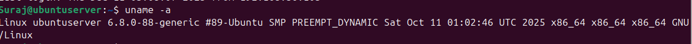
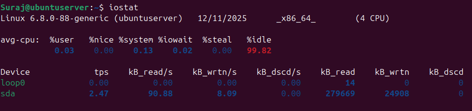
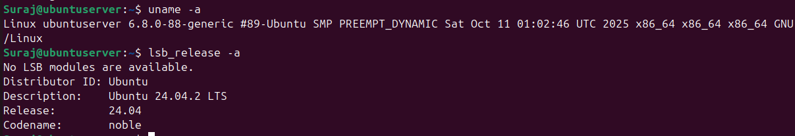
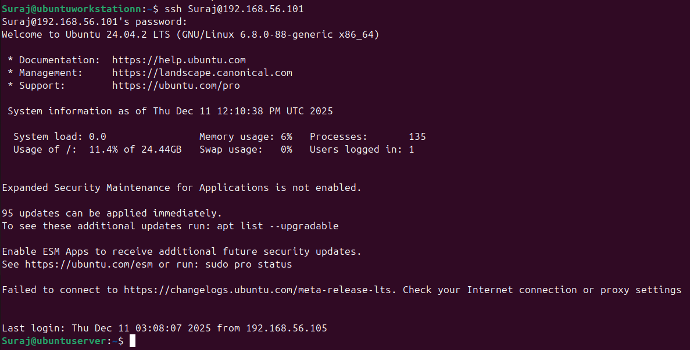
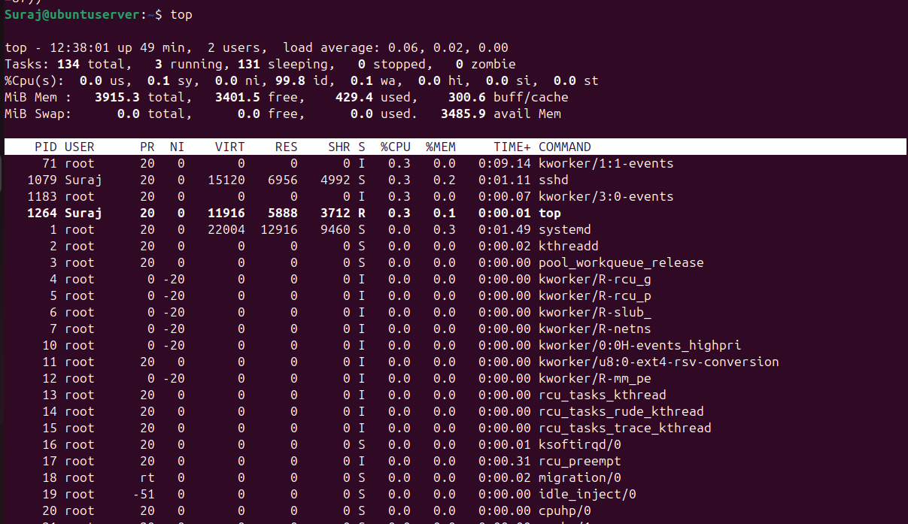
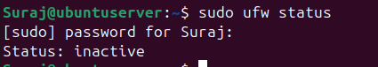
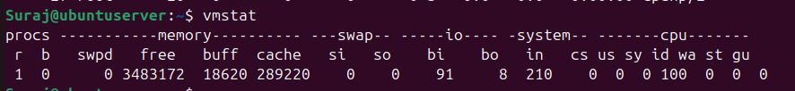
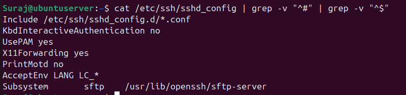

# Week 2: Security Planning and Testing Methodology

## Overview
This week focuses on designing a comprehensive security baseline and establishing a robust performance testing methodology for the Linux server deployment.

---

## 1. Performance Testing Plan

### Remote Monitoring Methodology
**Approach:**
- All performance monitoring will be conducted remotely via SSH from the workstation
- Data collection will use standard Linux utilities accessible through command-line interface
- Metrics will be captured at regular intervals to establish baseline and stress conditions

**Tools and Commands:**
```bash
# CPU monitoring
top -bn1 | grep "Cpu(s)"
mpstat 1 5

# Memory usage
free -h
vmstat 1 5

# Disk I/O
iostat -x 1 5
df -h

# Network monitoring
iftop -t -s 5
nethogs -t
```

### Command-Line Evidence

**System Information:**

*Figure 1: System information using `uname -a` showing kernel version and architecture*

**System Statistics:**

*Figure 2: I/O statistics with `iostat` for disk performance baseline*

**Process Listing:**

*Figure 3: Directory listing and file structure verification*

**Server Status:**

*Figure 4: Server operational status and running services*

**SSH Configuration:**

*Figure 5: SSH service status and configuration verification*

**System Resources:**

*Figure 6: Real-time system resource monitoring with `top`*

**Network Interface:**

*Figure 7: Network listening ports using `netstat -tulpn` or `ss -tulpn`*

**Firewall Status:**

*Figure 8: Firewall rules and status verification*

**Memory Statistics:**

*Figure 9: Virtual memory statistics using `vmstat` for baseline measurements*

**User Verification:**

*Figure 10: User and group verification using `grep` on system files*

### Testing Approach
**Baseline Testing:**
- Capture system metrics during idle state
- Record for 5-minute intervals to establish normal operating parameters
- Document baseline CPU, memory, disk, and network utilization

**Load Testing:**
- Apply controlled workloads using selected applications
- Monitor resource consumption during peak usage
- Compare against baseline measurements

**Data Collection Strategy:**
- Automated monitoring script (`monitor-server.sh`) to collect metrics
- Data logged to CSV format for analysis
- Screenshots captured for documentation

---

## 2. Security Configuration Checklist

### SSH Hardening
- [ ] Disable root login (`PermitRootLogin no`)
- [ ] Disable password authentication (`PasswordAuthentication no`)
- [ ] Enable key-based authentication only
- [ ] Change default SSH port (optional, consider trade-offs)
- [ ] Configure SSH idle timeout (`ClientAliveInterval`, `ClientAliveCountMax`)
- [ ] Restrict SSH access to specific users (`AllowUsers`)
- [ ] Disable X11 forwarding if not needed (`X11Forwarding no`)

### Firewall Configuration
- [ ] Install and enable UFW (Uncomplicated Firewall)
- [ ] Default deny all incoming traffic
- [ ] Allow SSH from workstation IP only
- [ ] Allow necessary service ports (document justification)
- [ ] Log dropped packets for monitoring
- [ ] Test firewall rules before disconnecting

### Mandatory Access Control
- [ ] Choose between SELinux or AppArmor
- [ ] Enable and configure chosen MAC system
- [ ] Create/modify security policies for critical services
- [ ] Document policy decisions and justifications
- [ ] Test application functionality under MAC policies

### Automatic Updates
- [ ] Configure unattended-upgrades package
- [ ] Enable automatic security updates only
- [ ] Schedule update checks (daily recommended)
- [ ] Configure email notifications (if applicable)
- [ ] Test update mechanism

### User Privilege Management
- [ ] Create non-root administrative user
- [ ] Configure sudo access with appropriate restrictions
- [ ] Implement password policies (if passwords used for sudo)
- [ ] Disable or remove unnecessary user accounts
- [ ] Review group memberships

### Network Security
- [ ] Disable IPv6 if not required
- [ ] Configure TCP wrappers for additional access control
- [ ] Implement fail2ban for intrusion prevention
- [ ] Review and disable unnecessary network services
- [ ] Configure network time synchronization (NTP)

---

## 3. Threat Model

### Threat 1: Unauthorized SSH Access
**Description:**  
Attackers attempt to gain unauthorized access to the server through SSH brute-force attacks or credential compromise.

**Risk Level:** High

**Mitigation Strategies:**
- Implement key-based authentication and disable password login
- Restrict SSH access to workstation IP address only via firewall rules
- Deploy fail2ban to automatically block repeated failed login attempts
- Use non-standard SSH port (trade-off: security through obscurity vs. convenience)
- Implement strong passphrase for SSH private key
- Regular monitoring of `/var/log/auth.log` for suspicious activity

**Implementation Priority:** Phase 4

---

### Threat 2: Privilege Escalation
**Description:**  
Compromised non-privileged user account attempts to gain root access through system vulnerabilities or misconfiguration.

**Risk Level:** Medium-High

**Mitigation Strategies:**
- Implement mandatory access control (SELinux/AppArmor) to restrict process capabilities
- Configure sudo with least-privilege principle (specific commands only)
- Enable automatic security updates to patch known vulnerabilities
- Regular security audits using Lynis to identify misconfigurations
- Disable unnecessary SUID/SGID binaries
- Monitor sudo usage logs for anomalies

**Implementation Priority:** Phase 5

---

### Threat 3: Service Exploitation
**Description:**  
Vulnerabilities in running network services could be exploited to compromise the system or launch attacks.

**Risk Level:** Medium

**Mitigation Strategies:**
- Minimize attack surface by running only essential services
- Keep all services updated through automatic security updates
- Use firewall to restrict service access to necessary ports and IPs only
- Implement SELinux/AppArmor profiles to contain service processes
- Regular vulnerability scanning with nmap and Lynis
- Monitor service logs for exploitation attempts
- Document justification for each running service

**Implementation Priority:** Phases 4-7

---

## Testing Schedule

| Week | Testing Focus | Key Activities |
|------|--------------|----------------|
| Week 3 | Application selection | Identify test applications, document expected profiles |
| Week 4 | Initial security | Verify SSH, firewall, user configs |
| Week 5 | Advanced security | Test MAC policies, fail2ban, monitoring scripts |
| Week 6 | Performance evaluation | Execute full test suite, collect metrics |
| Week 7 | Security audit | Lynis scanning, nmap assessment, final verification |

---

## Reflections

### Key Decisions
*Document your reasoning for specific security choices. For example:*
- Why did you choose SELinux vs AppArmor?
- What informed your firewall rule decisions?
- How did you balance security with usability?

### Anticipated Challenges
*Consider potential issues:*
- SSH key management and secure storage
- Performance impact of security controls
- Complexity of MAC policy configuration
- Monitoring overhead on system resources

### Learning Objectives
*What skills am I developing this week?*
- Security planning and threat modeling
- Understanding defense-in-depth strategy
- Performance testing methodology design
- Trade-off analysis between security and performance

---

## Next Steps
- Week 3: Select applications for performance testing
- Begin researching specific security implementations
- Review SSH hardening best practices
- Familiarize with chosen MAC system (SELinux/AppArmor)

---

## References
[1] "SSH Security Best Practices," Ubuntu Documentation. [Online]. Available: https://ubuntu.com/server/docs/security-best-practices [Accessed: Dec. 11, 2025]

[2] "UFW - Uncomplicated Firewall," Ubuntu Wiki. [Online]. Available: https://wiki.ubuntu.com/UncomplicatedFirewall [Accessed: Dec. 11, 2025]

*Add additional references as you conduct research*
