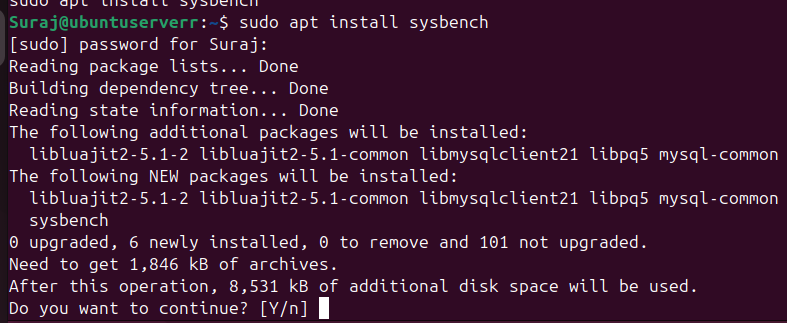
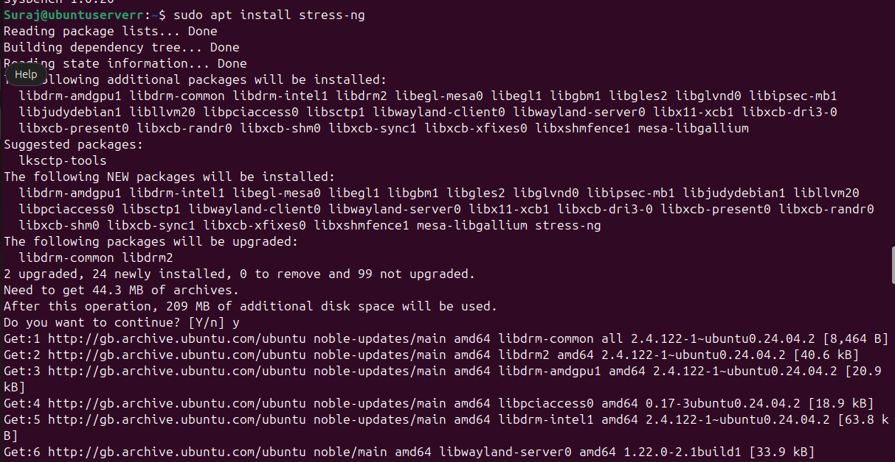
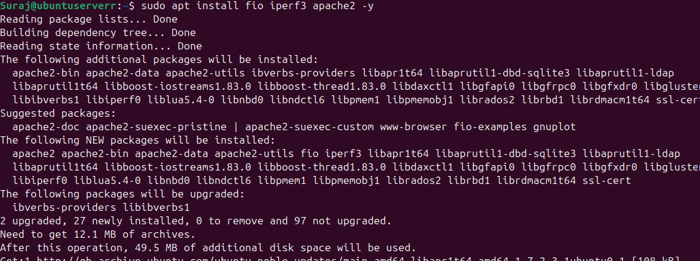
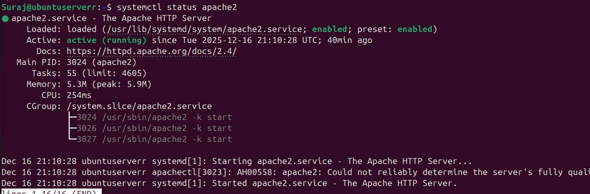
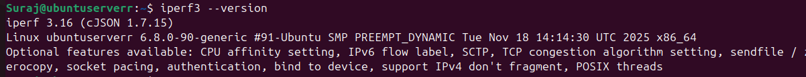
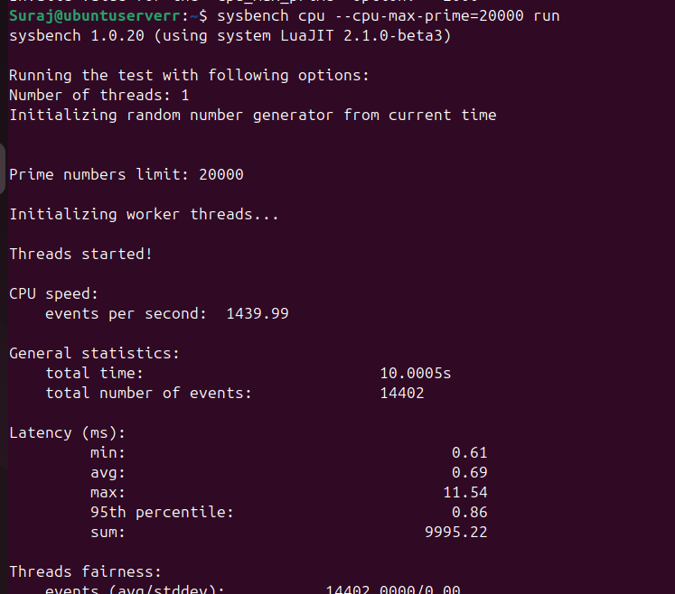
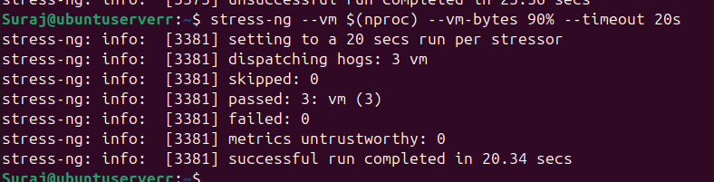
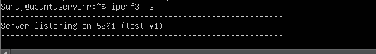
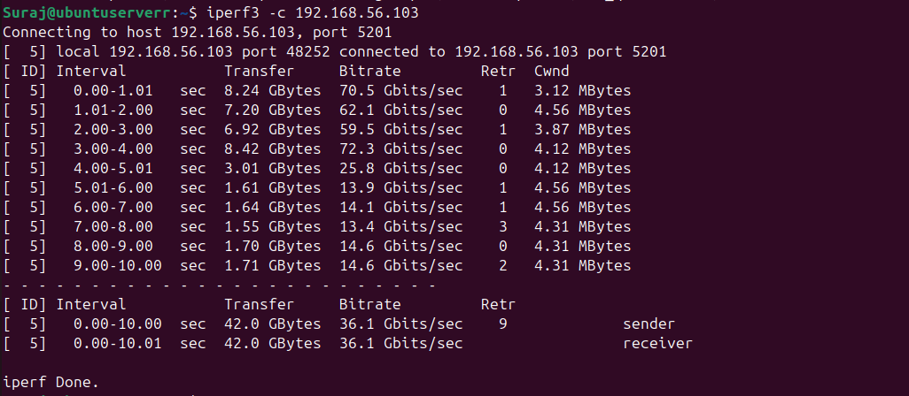

# Assessment Week 3: Performance Workload Generation and Tool Selection

## Introduction

The task of this week is to identify and defend particular applications and tools in the creation of different types of system workloads to be used in the performance assessment. On every chosen tool, we will describe its main characteristics and give the installation guide.s.

---

## Application Selection 

### CPU-Intensive Workload

To generate CPU-intensive workloads, several tools are available, including `stress`, `stress-ng`, `sysbench`, `openssl`, and `prime95`/`mprime`. 

**Sysbench** was selected as the preferred tool because it generates a mathematically consistent processor load based on prime number calculations. This provides a stable and repeatable benchmark for CPU performance.

#### Installation

This tool can be installed using `sudo apt install sysbench -y`.

Verification for installation can be done using `sysbench --version`.

---

### RAM-Intensive Workload

Tools for testing RAM performance include `stress`, `stress-ng`, and `memtester`. 

**Stress-ng** was chosen because it is an advanced version of the original `stress` tool. It allows for aggressive cycle memory allocation testing, which is effective for evaluating memory and swap performance.

#### Installation

Installation can be done by using the command: 

`sudo apt install stress-ng -y`

Verification: `stress-ng --version`

---

### I/O-Intensive Workload

Alternatives for I/O testing include `stress`, `stress-ng`, `dd`, and `fio`. 

**Fio (Flexible I/O Tester)** was selected due to its high flexibility and configurability. It is capable of simulating specific I/O patterns, such as those found in database or file server environments, and can bypass the operating system's cache to measure the true speed of the underlying hardware.

### Network-Intensive Workload

**iPerf3** was chosen over other alternatives such as `ping`, `mtr`, `netperf`, `nload`, `ethtool`, `netcat`, `hping3`, `pingpong`, and `bmon`.

The justification for selecting iPerf3 is based on the following features:

1. It generates pure TCP/UDP traffic between a client and server to accurately measure maximum throughput, jitter, and packet loss.
2. It is completely independent of hard drive speed, focusing solely on network capacity.
3. It is the optimal tool for testing network pipe capacity.

### Server-Based Workload

**Apache2** was included as a representative server application. It produces a mixed workload involving CPU, memory, disk, and network activity, closely reflecting real-world server usage.

#### Installation

Apache2 can be installed using:

`sudo apt install fio iperf3 apache2 -y `

Verification:

`iperf3 --version`

---

Verification:

`iperf3 --version`

## Application Selection Matrix

The following matrix details the tools selected to generate specific workloads for performance evaluation, along with the justification for their selection over alternative options.

| Workload Type | Selected Application | Alternatives Considered | Justification for Selection |
| :--- | :--- | :--- | :--- |
| **CPU-Intensive** | **Sysbench** | stress, stress-ng, openssl, prime95 | I selected it because of its deterministic CPU benchmarking based on prime number counting which provides consistent, repeatable, and comparable measurements of the processor performance. |
| **RAM-Intensive** | **Stress-ng** | stress, memtester | Selected as an improved stressor to stress, provides more developed memory stressors to facilitate aggressive pattern of allocation and efficient analysis of memory and swap behavior.|
| **I/O-Intensive** | **Fio** | dd, stress, stress-ng |Preferred due to its high configurability, enabling realistic simulation of database and file server I/O workloads while bypassing OS cache to measure true storage performance. |
| **Network-Intensive** | **iPerf3** | ping, netcat, nload, hping3 | This comes in extremely handy when benchmarking a network, as it measures TCP/UDP throughput, jitter, and loss of packets precisely and gives a solid idea of the network capacity without being influenced by disk performance. |
| **Server-Based** | **Apache2** | nginx, lighttpd |Chosen due to its common usage and the tendency to produce heterogeneous and real-world web-server workloads, and thus determining its relevance in assessing overall server performance. |

---

## Expected Resource Profiles

Based on the selected applications, we anticipate the following resource usage patterns during the testing phase:

### 1. CPU Evaluation (Sysbench)

We anticipate a resource profile showing **100% utilization** of all assigned cores (User CPU time). The system Load Average is expected to rise to match the number of virtual CPUs (vCPUs). Memory and Disk usage will remain negligible during this specific test.

**Test Execution**

Command given: `sysbench cpu --cpu-max-prime=20000 run`

---

### 2. RAM Evaluation (Stress-ng)

We expect RAM usage to spike rapidly until the physical memory limit is reached. Once physical RAM is full, we anticipate a significant increase in **Disk I/O** as the operating system begins **swapping** (moving inactive memory pages to disk to prevent system instability). Processes like `kswapd` may be observed consuming CPU cycles during this phase.

**Test Execution**

Command given: `stress-ng --vm $(nproc) --vm-bytes 90% --timeout 20s`

---

### 3. Disk I/O Evaluation (Fio)

The Disk Read/Write speeds are expected to reach the physical or throttled limit of the drive. Consequently, CPU usage will likely manifest as high **"iowait"** time (the time the CPU spends idle, waiting for disk operations to complete) rather than active processing.

**Test Execution**

Example command: `fio --name=randwrite --rw=randwrite --bs=4k --size=1G --runtime=30 --group_reporting`

---

### 4. Network Evaluation (iPerf3)

CPU and RAM usage are expected to remain low. The primary metric will be network throughput, which is anticipated to plateau at the limit of the virtual **Network Interface Card (NIC)** or the bandwidth cap imposed by the hosting provider.

**Rules for Testing using iPerf3**

1. iPerf3 must be installed on both the server and the client (Desktop).
2. The server must be enabled for listening using the command: `iperf3 -s`.
3. The client generates network traffic using the command: `iperf3 -c <serverip>`.
4. The firewall (UFW) must be configured to allow the necessary network traffic, which can be done using: `sudo ufw allow <port>/tcp` (or `udp`).

**Server Side**

**Client Side**

---

## Monitoring Strategy 

To measure the performance impact of the selected applications, we will utilize the monitoring tools and strategies established in Week 2, including `top`, `htop`, `vmstat`, `iostat`. Each workload was executed independently while observing real-time resource usage to identify bottlenecks and system behavior under stress.

---

## Reflection

This stage refined my understanding of biting work loads to system resources. The ability to use the appropriate tools enabled me to identify CPU, memory, disk, and network hang-ups more precisely. The findings will prove to be of great help when I address performance bottlenecks and configurations later.
