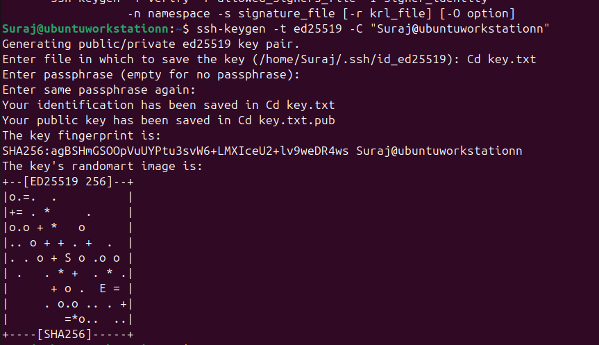
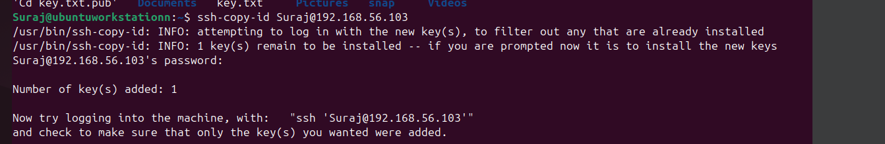
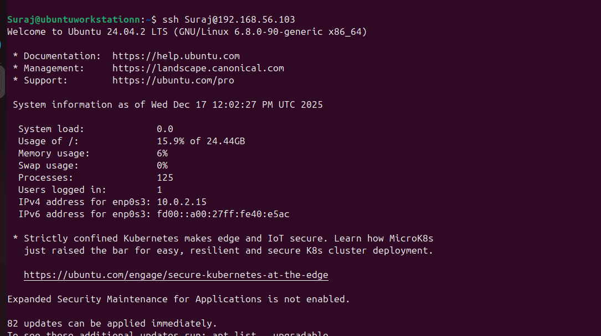
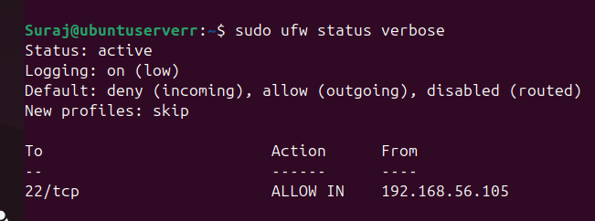
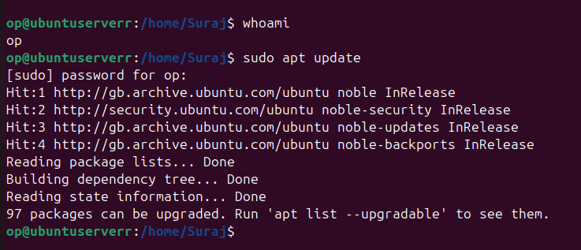
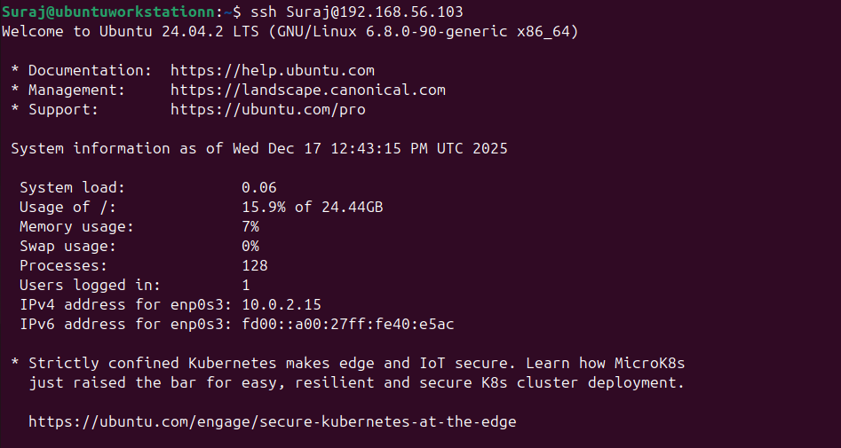
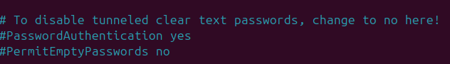
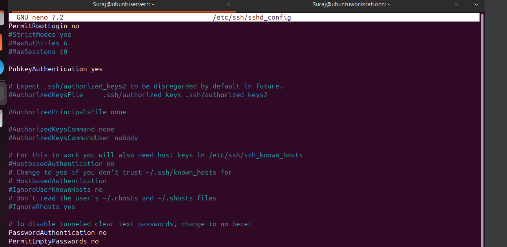
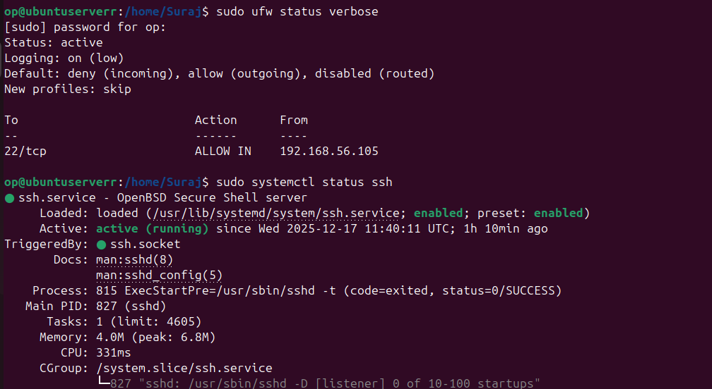

# Phase 4: Initial System Configuration & Security Implementation (Week 4)

##  Overview
Week 4 covered the integration of basic security measures within the Ubuntu Server setup. The two main goals were securing remote connections using SSH hardening, securing network access using the firewall, and properly dealing with user privileges. Every administrative activity was accomplished through a remote SSH connection, just like a practical scenario of server management.
The key accomplishments were:
* Configuring SSH with key-based authentication and disabling password login
* Implementing UFW firewall rules to restrict SSH access to authorized workstations only
* Creating and configuring a non-root administrative user with sudo privileges
* Successfully demonstrating remote system administration capabilities


---

## 1. SSH Configuration with Key-Based Authentication

### Objective

Configure SSH to use key-based authentication and disable password-based login.

### Steps Performed

* Generated SSH key pair on the workstation
* Copied public key to the Ubuntu server
* Updated SSH daemon configuration
* Restarted SSH service

### Commands Used

```bash
# Commands executed from the workstation
ssh-keygen -t ed25519 -C "admin@workstation"
ssh-copy-id adminuser@<server_ip>

sudo nano /etc/ssh/sshd_config
sudo systemctl restart ssh
```

### Configuration File Changes

**File:** `/etc/ssh/sshd_config`

#### Before Configuration

```text
# Default SSH configuration (excerpt)
#PasswordAuthentication yes
#PermitRootLogin prohibit-password
```

#### After Configuration

```text
PasswordAuthentication no
PubkeyAuthentication yes
PermitRootLogin no
```

### Screenshot Evidence

**SSH Key Generation:**



**SSH Key Copy:**



**SSH Key-Based Authentication:**



---

## 2. Firewall Configuration (Restricted SSH Access)

### Objective

Configure a firewall allowing SSH access **only from a specific workstation IP address**.

### Firewall Tool Used

* UFW (Uncomplicated Firewall)

### Steps Performed

* Enabled UFW
* Allowed SSH access from workstation IP only
* Denied all other incoming connections by default

### Commands Used

```bash
sudo ufw default deny incoming
sudo ufw default allow outgoing
sudo ufw allow from <workstation_ip> to any port 22 proto tcp
sudo ufw enable
```

### Complete Firewall Ruleset

```text
Status: active

To                         Action      From
--                         ------      ----
22/tcp                     ALLOW       <workstation_ip>

Default: deny (incoming), allow (outgoing), disabled (routed)
```

### Screenshot Evidence



---

## 3. User Management & Privilege Configuration

### Objective

Create a non-root administrative user and implement proper privilege management.

### Steps Performed

* Created a new non-root user
* Added user to `sudo` group
* Disabled direct root SSH login

### Commands Used

```bash
sudo adduser adminuser
sudo usermod -aG sudo adminuser
sudo passwd -l root
```

### Verification

* Logged in as non-root user via SSH
* Verified sudo privileges

### Screenshot Evidence



---

## 4. SSH Access Evidence

### Objective

Demonstrate successful remote SSH access from the workstation.

### Evidence

* SSH login prompt
* Successful connection confirmation

### Screenshot Evidence



---

## 5. Configuration Files – Before & After Comparison

### Files Modified

* `/etc/ssh/sshd_config`
* `/etc/ufw/user.rules` (if applicable)

### Comparison Evidence

#### Before Configuration



#### After Configuration



---

## 6. Firewall Documentation

### Default Policies

* Incoming: Deny
* Outgoing: Allow

### Allowed Services

| Service | Port | Source IP        |
| ------- | ---- | ---------------- |
| SSH     | 22   | <Workstation_IP> |

### Screenshot Evidence


---

## 7. Remote Administration Evidence

### Objective

Demonstrate administrative commands executed remotely via SSH.

### Commands Executed

```bash
sudo apt update
sudo apt upgrade -y
sudo ufw status verbose
whoami
```

### Screenshot Evidence



---
## Reflection
This stage marked the beginning of a critical shift from planning to the application of security concepts on the implementation stage. Operation on SSH alone without reliance on the local console meant doing things carefully to avoid loss of access to the servers.

The process of implementing helped to derive several key lessons. First, it was found that implementing the Principle of Least Privilege is a highly essential step, and by creating a separate management account instead of using root privileges, a secure management system was established. Next, by using a combination of SSH keys, firewalls, and limiting privileges to users, a layer of defense-in-depth was established.

Notably, this practical experience has reinforced the value of systematic and proven configuration changes in the process of securing live systems. Each change has required testing and validation before progressing, demonstrating how security needs may be balanced against the need for functionality and accessibility. The completion of these exercises has encouraged growing confidence in the implementation and management of secure Linux server infrastructure from a distant location.


## Conclusion

This phase successfully implemented foundational system security by securing SSH access, restricting network access through firewall rules, and enforcing least-privilege administration using a non-root user. All configurations were performed remotely via SSH in compliance with the administrative constraints.

The implementation demonstrated the practical application of security principles including:
- **Defense in Depth**: Multiple layers of security (SSH keys, firewall, user privileges)
- **Principle of Least Privilege**: Non-root administrative access with sudo
- **Secure Remote Access**: Key-based authentication with restricted IP access
- **Network Segmentation**: Firewall rules limiting exposure to authorized sources only

These foundational controls significantly reduced the server's attack surface and established a secure baseline for future system operations.

These foundational controls significantly reduced the server's attack surface and established a secure baseline for future system operations.
