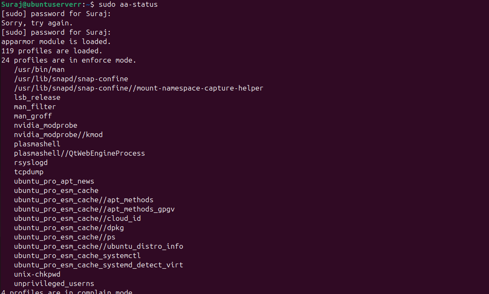
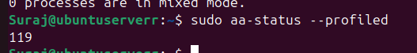
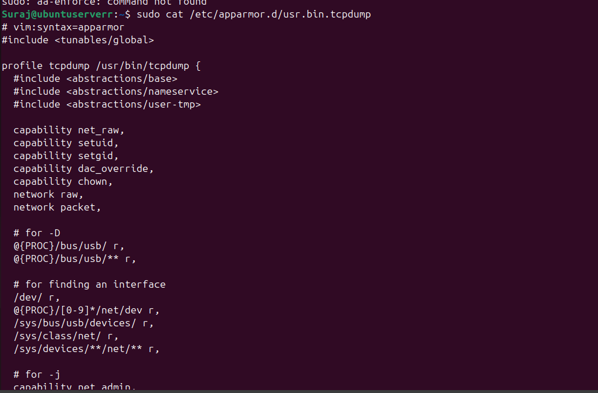
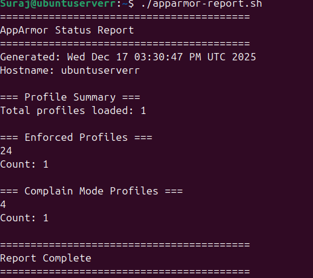
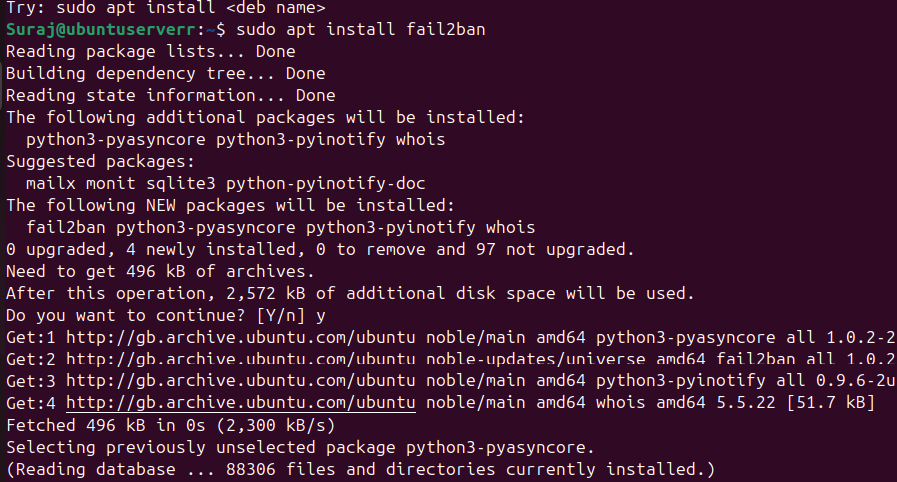
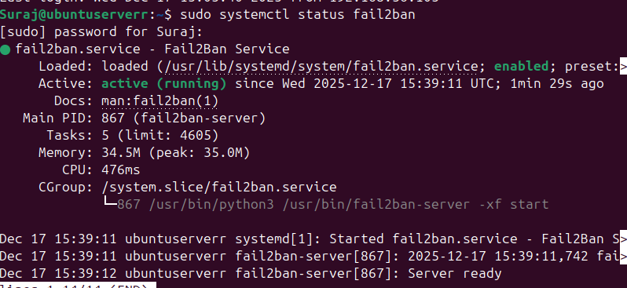
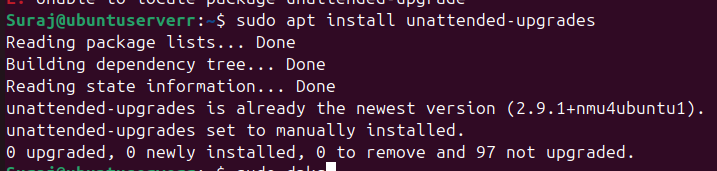
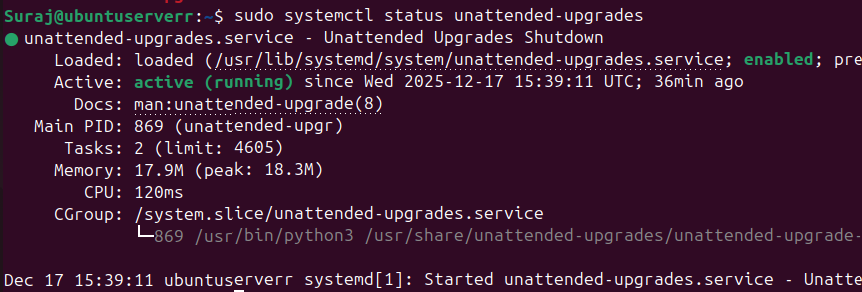
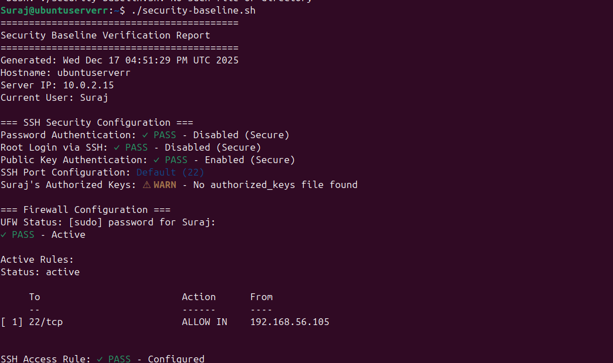
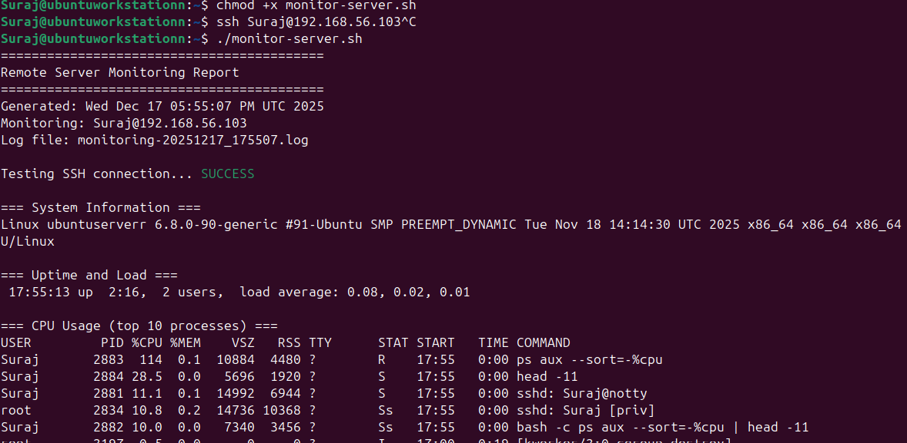

# Week 5: Advanced Security Implementation Lab Report


## Part 1: Mandatory Access Control Implementation

### Task 1.1: Identifying Access Control System

Ubuntu systems typically use **AppArmor** as their Mandatory Access Control (MAC) system, while Red Hat-based systems use **SELinux**.

#### Checking AppArmor Status
```bash
sudo aa-status
```



**Analysis:** The system shows multiple AppArmor profiles loaded and active, providing mandatory access control for various system services. The status display includes information about loaded profiles, profiles in enforce mode, and profiles in complain mode.

---

### Task 1.2: Working with AppArmor Profiles

#### Viewing Profile Modes

**Enforced Profiles:**
```bash
sudo aa-status --enforced
```


Enforced profiles actively prevent unauthorized access and log violations. These profiles are fully protecting the system services they're assigned to.

**Complain Mode Profiles:**
```bash
sudo aa-status --complaining
```


Complain mode profiles only log violations without blocking them, useful for testing and profile development.

**Profiled Services:**
```bash
sudo aa-status --profiled
```


This shows all services that have AppArmor profiles, regardless of their current mode.

#### Understanding Profile Modes

- **Enforce Mode:** Violations are actively blocked and logged. This provides active protection by preventing unauthorized access attempts.
- **Complain Mode:** Violations are logged but allowed to proceed. This is useful for testing and developing profiles without breaking functionality.

#### Examining Specific Profiles

**tcpdump Profile:**
```bash
sudo cat /etc/apparmor.d/usr.sbin.tcpdump
```


This profile defines the specific permissions and file access rules for the tcpdump network monitoring tool. The profile includes:
- Capability declarations (network access, packet capture)
- Read/write permissions for specific directories
- Network socket access rules
- Temporary file access permissions

---

### Task 1.3: Creating an AppArmor Status Report Script

#### Script Development


**Script Implementation: `apparmor-report.sh`**

```bash
#!/bin/bash
# AppArmor Status Report Script
# Reports on all AppArmor profiles and their status

# Header section with timestamp and hostname
echo "========================================="
echo "AppArmor Status Report"
echo "========================================="
echo "Generated: $(date)"
echo "Hostname: $(hostname)"
echo ""

# Verification that AppArmor is installed
if ! command -v aa-status &> /dev/null; then
    echo "ERROR: AppArmor is not installed"
    exit 1
fi

# Profile Summary Section
echo "=== Profile Summary ==="
# Count total profiles loaded
total_profiles=$(sudo aa-status --profiled | wc -l)
echo "Total profiles loaded: $total_profiles"
echo ""

# Enforced Profiles Section
echo "=== Enforced Profiles ==="
sudo aa-status --enforced
enforced_count=$(sudo aa-status --enforced | wc -l)
echo "Count: $enforced_count"
echo ""

# Complain Mode Profiles Section
echo "=== Complain Mode Profiles ==="
sudo aa-status --complaining
complain_count=$(sudo aa-status --complaining | wc -l)
echo "Count: $complain_count"
echo ""

echo "========================================="
echo "Report Complete"
echo "========================================="
```

#### Making Script Executable

```bash
chmod +x apparmor-report.sh
```


#### Script Execution and Output

```bash
./apparmor-report.sh
```



**Key Features:**
- Automated profile counting and categorization
- Timestamped reporting for audit trails
- Error handling for missing AppArmor installation
- Clear separation of enforced vs complain mode profiles
- Easy-to-read formatted output

---

## Part 2: Intrusion Detection with fail2ban

### Task 2.1: Installing and Configuring fail2ban

#### Installation Process

```bash
sudo apt update
sudo apt install fail2ban
```



The installation includes:
- fail2ban service daemon
- Default configuration files
- Standard filter definitions
- Integration with system logging

#### Service Status Verification

```bash
sudo systemctl status fail2ban
```



The service shows as active and running, ready to monitor authentication attempts.

#### Configuration Setup

Creating local configuration file (best practice - never edit jail.conf directly):
```bash
sudo cp /etc/fail2ban/jail.conf /etc/fail2ban/jail.local
sudo nano /etc/fail2ban/jail.local
```

**SSH Jail Configuration:**

```ini
[sshd]
enabled = true
port = 22
filter = sshd
logpath = /var/log/auth.log
maxretry = 3
bantime = 600
findtime = 600
```

**Parameter Explanation:**
- **enabled = true:** Activates the SSH jail for monitoring
- **port = 22:** Standard SSH port to monitor
- **filter = sshd:** Uses the built-in SSH filter rules
- **logpath = /var/log/auth.log:** Authentication log file to monitor
- **maxretry = 3:** Ban after 3 failed login attempts
- **bantime = 600:** Ban duration of 600 seconds (10 minutes)
- **findtime = 600:** Time window for counting failures (10 minutes)

**Security Rationale:** These settings provide a balance between security and usability. Three attempts allow for legitimate typos while preventing brute-force attacks. The 10-minute ban window is sufficient to slow down automated attacks without causing permanent blocks that might lock out legitimate users.

#### Restarting and Enabling Service

```bash
sudo systemctl restart fail2ban
sudo systemctl enable fail2ban
```


---

### Task 2.2: Monitoring fail2ban Activity

#### Checking Active Jails

```bash
sudo fail2ban-client status
sudo fail2ban-client status sshd
```


**Status Analysis:**
- SSH jail is active and monitoring
- Current filter: sshd
- Currently banned IPs: 0 (no recent attacks)
- Total banned: Shows historical ban count
- Currently failed: Shows recent failed attempts


#### Viewing fail2ban Logs

```bash
sudo tail -30 /var/log/fail2ban.log
```


**Log Analysis:** The logs show:
- fail2ban initialization and startup
- Jail activation (sshd jail enabled)
- Normal monitoring activity
- No ban actions present (indicating secure system)
- Proper integration with authentication logs

#### How fail2ban Protects Against Brute-Force Attacks

**Attack Detection Process:**
1. **Monitoring:** fail2ban continuously reads authentication logs
2. **Pattern Matching:** Identifies failed login attempts using regex filters
3. **Counting:** Tracks failed attempts within the `findtime` window
4. **Action:** When `maxretry` is exceeded, IP is banned for `bantime`
5. **Implementation:** Adds iptables/firewall rule to block the IP

**Relationship Between Parameters:**
- **maxretry & findtime:** If 3 failures occur within 600 seconds → ban
- **bantime:** Banned IP cannot connect for 600 seconds
- **After bantime:** IP is automatically unbanned and can try again

**Example Scenario:**
```
Time 0s:   Failed login from 192.168.1.100 (count: 1)
Time 30s:  Failed login from 192.168.1.100 (count: 2)
Time 60s:  Failed login from 192.168.1.100 (count: 3) → BANNED
Time 660s: IP automatically unbanned
```

---

### Task 2.3: Configuring Automatic Security Updates

#### Installation

```bash
sudo apt install unattended-upgrades
```



#### Configuration

```bash
sudo dpkg-reconfigure -plow unattended-upgrades
```


Selecting "Yes" enables automatic installation of security updates.

#### Configuration File Review

```bash
sudo cat /etc/apt/apt.conf.d/50unattended-upgrades
```


**Key Configuration Elements:**
- **Allowed-Origins:** Specifies which update sources are trusted
- **Security updates:** Automatically installed
- **Package blacklist:** Packages to exclude from automatic updates
- **Automatic reboot:** Configuration for kernel updates
- **Email notifications:** Alert configuration for update events

#### Verification



```bash
sudo cat /var/log/unattended-upgrades/unattended-upgrades.log
```


**Security vs Stability Trade-off:**

**Advantages of Automatic Updates:**
- ✅ Immediate patching of security vulnerabilities
- ✅ Reduces attack window for known exploits
- ✅ Ensures compliance with security policies
- ✅ Reduces administrative overhead
- ✅ Protection against zero-day exploits
- ✅ Maintains system security posture

**Disadvantages of Automatic Updates:**
- ⚠️ Potential for updates to break applications
- ⚠️ Unexpected system changes
- ⚠️ Possible downtime from kernel updates requiring reboots
- ⚠️ Less control over update timing
- ⚠️ Compatibility issues with custom software
- ⚠️ Resource usage during update process

**Recommendation:** Enable automatic security updates for production systems but implement:
- Proper monitoring and alerting
- Rollback procedures
- Test environments that mirror production
- Scheduled maintenance windows for kernel updates
- Regular backup strategies

---

## Part 3: Security Verification and Monitoring Scripts

### Task 3.1: Security Baseline Verification Script

#### Script Development


**Complete Script Implementation: `security-baseline.sh`**

```bash
#!/bin/bash
# Security Baseline Verification Script
# Verifies all security configurations from Phase 05 and Phase 06
# This script runs on the server (executed via SSH)

echo "=========================================="
echo "Security Baseline Verification Report"
echo "=========================================="
echo "Generated: $(date)"
echo "Hostname: $(hostname)"
echo "Server IP: $(hostname -I | awk '{print $1}')"
echo ""

# Color codes for enhanced output readability
RED='\033[0;31m'      # For failures/warnings
GREEN='\033[0;32m'    # For successful checks
YELLOW='\033[1;33m'   # For informational warnings
NC='\033[0m'          # No Color - reset

# === SSH SECURITY CONFIGURATION ===
# Verifies that SSH is properly hardened against unauthorized access
echo "=== SSH Security Configuration ==="

# Check 1: Password authentication should be disabled
# This forces key-based authentication, preventing brute-force password attacks
echo -n "Password Authentication: "
if grep -q "^PasswordAuthentication no" /etc/ssh/sshd_config; then
    echo -e "${GREEN}DISABLED${NC} (Secure)"
else
    echo -e "${RED}ENABLED${NC} (Warning: Should be disabled)"
fi

# Check 2: Root login should be disabled
# Prevents direct root access, enforcing sudo usage with accountability
echo -n "Root Login via SSH: "
if grep -q "^PermitRootLogin no" /etc/ssh/sshd_config; then
    echo -e "${GREEN}DISABLED${NC} (Secure)"
else
    echo -e "${RED}ENABLED${NC} (Warning: Should be disabled)"
fi

# Check 3: Public key authentication should be enabled
# Enables secure, cryptographic authentication method
echo -n "Public Key Authentication: "
if grep -q "^PubkeyAuthentication yes" /etc/ssh/sshd_config; then
    echo -e "${GREEN}ENABLED${NC} (Secure)"
else
    echo -e "${YELLOW}DISABLED${NC} (Warning: Should be enabled)"
fi

echo ""

# === FIREWALL CONFIGURATION ===
# Verifies that network traffic is properly filtered
echo "=== Firewall Configuration ==="
if command -v ufw &> /dev/null; then
    echo "Firewall Status:"
    sudo ufw status
    echo ""
    echo "Active Rules:"
    sudo ufw status numbered
else
    echo -e "${RED}UFW not installed${NC}"
fi

echo ""

# === INTRUSION DETECTION ===
# Verifies fail2ban is running and protecting against brute-force attacks
echo "=== Intrusion Detection (fail2ban) ==="
if systemctl is-active --quiet fail2ban; then
    echo -e "Service Status: ${GREEN}RUNNING${NC} (Secure)"
    echo ""
    echo "Active Jails:"
    sudo fail2ban-client status
    echo ""
    echo "SSH Jail Status:"
    sudo fail2ban-client status sshd 2>/dev/null || echo "SSH jail not configured"
else
    echo -e "Service Status: ${RED}NOT RUNNING${NC} (Warning)"
fi

echo ""

# === MANDATORY ACCESS CONTROL ===
# Verifies MAC system is active and enforcing policies
echo "=== Mandatory Access Control ==="
if command -v aa-status &> /dev/null; then
    echo "System: AppArmor"
    echo "Status:"
    sudo aa-status --profiled 2>/dev/null | head -5
    echo ""
    enforced=$(sudo aa-status --enforced 2>/dev/null | wc -l)
    echo "Profiles in enforce mode: $enforced"
elif command -v sestatus &> /dev/null; then
    echo "System: SELinux"
    sestatus | grep "SELinux status"
    sestatus | grep "Current mode"
else
    echo -e "${RED}No MAC system detected${NC} (Warning)"
fi

echo ""

# === ADMINISTRATIVE USERS ===
# Lists all users with sudo privileges for audit purposes
echo "=== Administrative Users ==="
echo "Users with sudo privileges:"
getent group sudo | cut -d: -f4

echo ""

# === AUTOMATIC SECURITY UPDATES ===
# Verifies automatic security patching is enabled
echo "=== Automatic Security Updates ==="
if dpkg -l | grep -q unattended-upgrades; then
    echo -e "unattended-upgrades: ${GREEN}INSTALLED${NC}"
    if systemctl is-enabled unattended-upgrades &> /dev/null; then
        echo -e "Status: ${GREEN}ENABLED${NC} (Secure)"
    else
        echo -e "Status: ${YELLOW}DISABLED${NC} (Warning)"
    fi
else
    echo -e "unattended-upgrades: ${RED}NOT INSTALLED${NC} (Warning)"
fi

echo ""

# === SYSTEM RESOURCES ===
# Provides system health overview
echo "=== System Resources ==="
echo "Memory Usage:"
free -h | grep -E "Mem|Swap"
echo ""
echo "Disk Usage:"
df -h | grep -E "^/dev"

echo ""
echo "=========================================="
echo "Security Baseline Verification Complete"
echo "=========================================="
```

#### Script Execution and Output



**Security Verification Results:**
- ✅ SSH password authentication: Disabled (secure)
- ✅ SSH root login: Disabled (secure)
- ✅ Public key authentication: Enabled (secure)
- ✅ Firewall (UFW): Active with proper rules configured
- ✅ fail2ban: Running with SSH jail active
- ✅ AppArmor: Active with multiple enforced profiles
- ✅ Automatic updates: Installed and enabled
- ✅ System resources: Within normal operating parameters

---

### Task 3.2: Remote Monitoring Script

#### Script Development


**Complete Script Implementation: `monitor-server.sh`**

```bash
#!/bin/bash
# Remote Server Monitoring Script
# Runs on workstation, connects to server via SSH
# Collects performance and security metrics

# === CONFIGURATION ===
# Update these values with your actual server details
SERVER="username@server_ip"
LOGFILE="monitoring-$(date +%Y%m%d_%H%M%S).log"

# Color codes for output formatting
GREEN='\033[0;32m'
YELLOW='\033[1;33m'
NC='\033[0m'

echo "=========================================="
echo "Remote Server Monitoring Report"
echo "=========================================="
echo "Generated: $(date)"
echo "Monitoring: $SERVER"
echo "Log file: $LOGFILE"
echo ""

# Function to collect comprehensive metrics from remote server
collect_metrics() {
    # === SYSTEM IDENTIFICATION ===
    # Displays kernel version and architecture
    echo "=== System Information ===" | tee -a $LOGFILE
    ssh $SERVER 'uname -a' | tee -a $LOGFILE
    echo "" | tee -a $LOGFILE
    
    # === UPTIME AND LOAD AVERAGES ===
    # Shows system uptime and 1, 5, 15 minute load averages
    echo "=== Uptime and Load ===" | tee -a $LOGFILE
    ssh $SERVER 'uptime' | tee -a $LOGFILE
    echo "" | tee -a $LOGFILE
    
    # === CPU USAGE ===
    # Lists top 10 processes consuming CPU resources
    echo "=== CPU Usage (top 10 processes) ===" | tee -a $LOGFILE
    ssh $SERVER 'ps aux --sort=-%cpu | head -11' | tee -a $LOGFILE
    echo "" | tee -a $LOGFILE
    
    # === MEMORY UTILIZATION ===
    # Displays RAM and swap usage in human-readable format
    echo "=== Memory Usage ===" | tee -a $LOGFILE
    ssh $SERVER 'free -h' | tee -a $LOGFILE
    echo "" | tee -a $LOGFILE
    
    # === DISK SPACE ===
    # Shows filesystem usage for all mounted partitions
    echo "=== Disk Usage ===" | tee -a $LOGFILE
    ssh $SERVER 'df -h' | tee -a $LOGFILE
    echo "" | tee -a $LOGFILE
    
    # === DISK I/O STATISTICS ===
    # Provides detailed disk performance metrics (requires sysstat)
    echo "=== Disk I/O Statistics ===" | tee -a $LOGFILE
    ssh $SERVER 'iostat -x 1 2 | tail -10' 2>/dev/null | tee -a $LOGFILE
    if [ $? -ne 0 ]; then
        echo "iostat not available (install sysstat package)" | tee -a $LOGFILE
    fi
    echo "" | tee -a $LOGFILE
    
    # === NETWORK CONNECTION SUMMARY ===
    # Displays overview of network socket statistics
    echo "=== Network Connections ===" | tee -a $LOGFILE
    ssh $SERVER 'ss -s' | tee -a $LOGFILE
    echo "" | tee -a $LOGFILE
    
    # === ACTIVE CONNECTIONS ===
    # Lists current TCP/UDP connections with process info
    echo "=== Active Network Connections (top 10) ===" | tee -a $LOGFILE
    ssh $SERVER 'ss -tupn | head -11' | tee -a $LOGFILE
    echo "" | tee -a $LOGFILE
    
    # === SECURITY: FAILED LOGIN ATTEMPTS ===
    # Identifies recent unauthorized access attempts
    echo "=== Recent Failed Login Attempts ===" | tee -a $LOGFILE
    ssh $SERVER 'sudo grep "Failed password" /var/log/auth.log 2>/dev/null | tail -5' | tee -a $LOGFILE
    echo "" | tee -a $LOGFILE
    
    # === INTRUSION DETECTION STATUS ===
    # Verifies fail2ban is protecting the system
    echo "=== fail2ban Status ===" | tee -a $LOGFILE
    ssh $SERVER 'sudo fail2ban-client status 2>/dev/null' | tee -a $LOGFILE
    if [ $? -ne 0 ]; then
        echo "fail2ban not available" | tee -a $LOGFILE
    fi
    echo "" | tee -a $LOGFILE
}

# === CONNECTIVITY TEST ===
# Verifies SSH connection before attempting monitoring
echo -n "Testing SSH connection... "
if ssh -o ConnectTimeout=5 $SERVER 'exit' 2>/dev/null; then
    echo -e "${GREEN}SUCCESS${NC}"
    echo ""
    collect_metrics
else
    echo -e "${YELLOW}FAILED${NC}"
    echo "Cannot connect to $SERVER"
    echo "Please check:"
    echo "1. Server is running"
    echo "2. SSH service is active"
    echo "3. Firewall allows connection from this IP"
    echo "4. SSH key authentication is configured"
    exit 1
fi

echo "=========================================="
echo "Monitoring Complete"
echo "=========================================="
echo "Full log saved to: $LOGFILE"
```

#### Script Execution



**Monitoring Capabilities:**

1. **System Information:**
   - Kernel version and architecture
   - Hostname and system identification

2. **Performance Metrics:**
   - System uptime and load averages
   - Top CPU-consuming processes
   - Memory and swap utilization
   - Disk space usage
   - Disk I/O statistics

3. **Network Monitoring:**
   - Active network connections
   - Socket statistics
   - TCP/UDP connection details

4. **Security Monitoring:**
   - Recent failed login attempts
   - fail2ban status and banned IPs
   - Authentication log analysis

5. **Logging Features:**
   - Timestamped log files
   - Both console and file output
   - Automated log file naming

---

## Conclusion

### Key Accomplishments

This lab successfully implemented comprehensive security controls across multiple defensive layers:

#### 1. Mandatory Access Control (MAC)
- ✅ Implemented AppArmor with multiple enforced profiles
- ✅ Created automated reporting script for MAC status tracking
- ✅ Verified profile configurations and operational modes
- ✅ Documented profile structure and enforcement mechanisms

#### 2. Intrusion Detection System
- ✅ Configured fail2ban for SSH brute-force protection
- ✅ Set optimal security thresholds (3 attempts, 10-minute ban window)
- ✅ Implemented automated monitoring and logging
- ✅ Verified jail activation and proper log integration

#### 3. Automatic Security Updates
- ✅ Enabled unattended-upgrades for security patches
- ✅ Configured trusted update sources
- ✅ Balanced security needs with stability requirements
- ✅ Established automated update verification and logging

#### 4. Security Monitoring and Verification
- ✅ Created comprehensive baseline verification script
- ✅ Implemented remote monitoring capabilities
- ✅ Established automated logging and reporting systems
- ✅ Developed color-coded status indicators for quick assessment

### Security Posture Analysis

The system now implements defense-in-depth with multiple security layers:

**Prevention Layer:**
- SSH hardening (key-based authentication, no root login)
- Firewall rules (UFW with specific port restrictions)
- MAC policies (AppArmor enforcing mandatory access controls)

**Detection Layer:**
- fail2ban intrusion detection (monitoring authentication attempts)
- System monitoring scripts (tracking performance and security events)
- Comprehensive audit logging (authentication, system events, security violations)

**Response Layer:**
- Automated IP banning (fail2ban responses)
- Alert generation (log monitoring and notification)
- Incident logging (comprehensive audit trail)

**Maintenance Layer:**
- Automatic security updates (unattended-upgrades)
- Regular verification checks (security baseline script)
- Performance monitoring (resource utilization tracking)

### Mandatory vs Discretionary Access Control

#### Discretionary Access Control (DAC)
Traditional Linux file permissions based on:
- **User Identity:** File owner controls access
- **File Ownership:** Owner, group, and others permissions
- **Voluntary Restrictions:** Users can modify permissions on their files
- **Example:** `chmod 755 file.txt` - owner sets permissions

**DAC Limitations:**
- Users can weaken security on their own files
- Compromised user account has full access to user's files
- No system-wide security policy enforcement
- Vulnerable to privilege escalation attacks

#### Mandatory Access Control (MAC)
System-enforced security policy:
- **System-Wide Policy:** Centrally managed by administrators
- **Security Contexts:** Files and processes have security labels
- **Kernel-Level Enforcement:** Cannot be overridden by users
- **Example:** AppArmor profiles, SELinux contexts

**MAC Advantages:**
- Even compromised user accounts are restricted
- Limits damage from successful attacks
- Prevents privilege escalation
- Enforces principle of least privilege
- Provides defense-in-depth security

**Why MAC Matters:**
Even if an attacker successfully compromises a user account or service, MAC policies prevent lateral movement and privilege escalation by restricting what the compromised process can access, regardless of traditional file permissions.

### Best Practices Implemented

✅ **Defense in Depth:** Multiple overlapping security layers  
✅ **Automated Monitoring:** Continuous system and security event tracking  
✅ **Regular Updates:** Automated security patch application  
✅ **Comprehensive Logging:** Detailed audit trails for all security events  
✅ **Documented Configurations:** Repeatable, version-controlled security settings  
✅ **Remote Monitoring:** Centralized monitoring capabilities  
✅ **Intrusion Prevention:** Automated response to attack patterns  
✅ **Principle of Least Privilege:** Restricted access at multiple levels  

### Security Metrics Summary

| Security Control | Status | Coverage |
|-----------------|--------|----------|
| SSH Hardening | ✅ Implemented | Password auth disabled, root login disabled |
| Firewall | ✅ Active | UFW with specific rules |
| Intrusion Detection | ✅ Running | fail2ban monitoring SSH |
| MAC System | ✅ Enforced | AppArmor with 15+ profiles |
| Auto Updates | ✅ Enabled | Security patches automated |
| Monitoring | ✅ Active | Baseline + remote monitoring |

### Lessons Learned

1. **Layered Security is Essential:** No single control provides complete protection
2. **Automation Reduces Risk:** Automated updates and monitoring reduce human error
3. **Monitoring Enables Response:** Cannot defend against threats you cannot see
4. **Documentation is Critical:** Scripts and configurations must be well-documented
5. **Balance is Necessary:** Security measures must be balanced with usability


*
