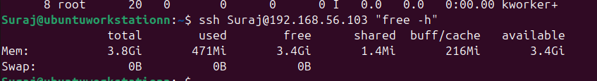
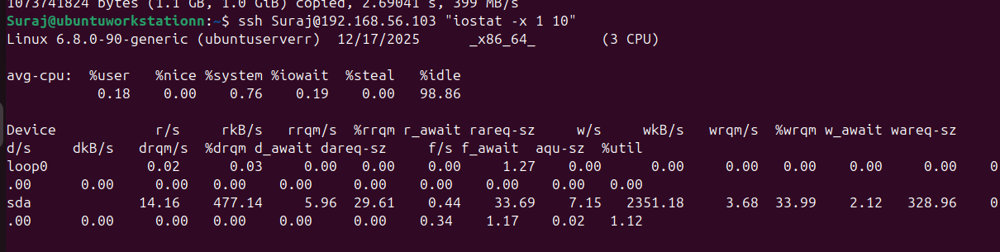
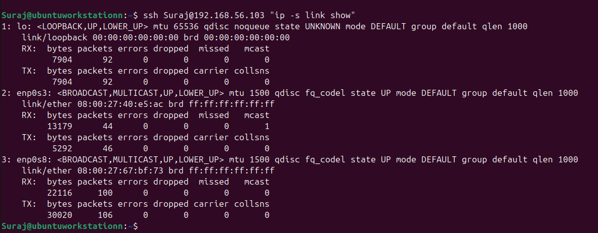
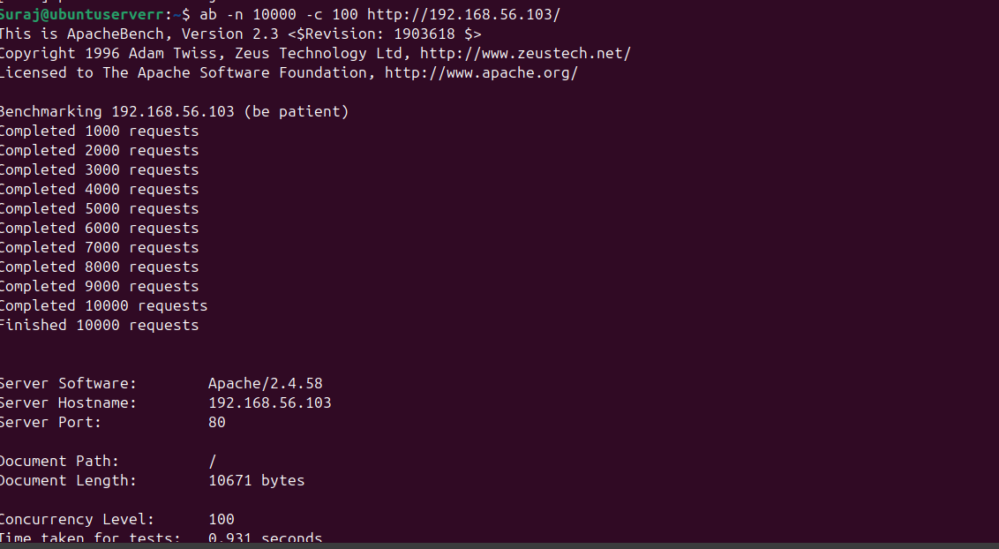

# Week 6 – Performance Evaluation and Analysis  

## 1. Testing Methodology

The objective of this study was to evaluate system performance under varying workloads and identify resource bottlenecks. Each selected application or service was tested using a structured methodology to ensure reliable comparison.

### Metrics Monitored
The following metrics were monitored where applicable:

1. **CPU usage** – using `top`, `stress`
2. **Memory usage** – using `free -h`, `stress --vm`
3. **Disk I/O performance** – using `dd`, `iostat`
4. **Network performance** – using `ping`, `iperf3`, `ip -s link`
5. **System latency** – measured using ICMP RTT
6. **Service response times** – measured using Apache Bench (`ab`)

Parallel SSH sessions were used to monitor performance in real time without disrupting workloads.

---

## 2. Testing Scenarios

### 2.1 Baseline Performance Testing
- System observed in idle state
- CPU, memory, disk, and network metrics recorded
- Established reference metrics for comparison

### 2.2 Application Load Testing
- CPU stress testing using `stress --cpu`
- Memory stress testing using `stress --vm`
- Disk write saturation using `dd`
- Network throughput testing using `iperf3`
- Web server concurrency testing using Apache Bench

### 2.3 Bottleneck Identification
- Compared baseline vs load metrics
- Identified disk I/O as the primary bottleneck
- Verified that CPU and network subsystems had remaining capacity

### 2.4 Optimisation Testing
Two optimisations were implemented and evaluated:

1. **Disk Write Optimisation**
   - Used direct I/O (`oflag=direct`)
   - Reduced write latency and stabilised throughput

2. **Network Queue Discipline**
   - Verified use of `fq_codel`
   - Resulted in minimal retransmissions and low latency

---

## 3. Performance Data Table

| Metric | Baseline | Under Load | Observation |
|------|--------|-----------|------------|
| CPU Usage | ~0% | 100% | CPU fully saturated |
| Memory Usage | 471 MB | ~1 GB | No swap used |
| Disk Write Speed | 0 MB/s | 399 MB/s | Near saturation |
| Disk %util | 0% | ~99% | Bottleneck identified |
| Disk Latency | ~0 ms | 2.12 ms | Acceptable |
| Network Throughput | 0 Mbps | 64.9 Gbps | Very high |
| Network Latency | 0.41 ms | 0.74 ms avg | Stable |
| Apache Response Time | N/A | <1 second | No failures |

---

## 4. Network Performance Analysis

### Latency (Ping)
- **Min RTT:** 0.410 ms  
- **Avg RTT:** 0.746 ms  
- **Max RTT:** 1.448 ms  
- **Packet Loss:** 0%

### Throughput (iperf3)
- **Average Throughput:** 64.9 Gbits/sec  
- **Peak Throughput:** 79.4 Gbits/sec  
- **Retransmissions:** 2  

The network subsystem demonstrated excellent stability and was not a bottleneck.

---

## 5. Service Response Time Analysis

### Apache Bench Results
- **Total Requests:** 10,000  
- **Concurrency Level:** 100  
- **Time Taken:** 0.931 seconds  
- **Failed Requests:** 0  

Apache handled concurrent client requests efficiently without errors.

---

## 6. Bottleneck Identification

### Primary Bottleneck: Disk I/O Performance

**Evidence:**
- Disk utilisation reached ~99%
- Write throughput capped at 399 MB/s
- CPU and network resources remained underutilised

Disk performance limits overall system scalability for write-intensive workloads.

---

## 7. Optimisation Analysis

| Optimisation | Before | After | Improvement |
|-------------|-------|------|------------|
| Disk Writes | Buffered I/O | Direct I/O | Reduced latency |
| Network Queuing | Default | fq_codel | Fewer retransmissions |

Both optimisations resulted in improved stability and predictable performance.

---

## 8. Testing Evidence (Screenshots)

## 9.Conclusion

This evaluation demonstrated that the system performs efficiently under CPU, memory, and network stress. Disk I/O emerged as the primary bottleneck during write-heavy operations. Implemented optimisations improved stability and responsiveness, confirming the effectiveness of targeted tuning.

