# Week 7: Security Audit and System Evaluation (Phase 7)


## 1) Executive Summary

This report documents a security audit and system configuration review of the Ubuntu server. The audit used automated scanning (**Lynis**), network exposure assessment (**nmap**), firewall/access control verification (**UFW/iptables + blocked-port test**), and service auditing (**ss + systemctl**) followed by remediation and validation (Lynis re-scan).

### Key Before/After Results (Lynis)

| Metric | Initial | After Remediation | Change |
|---|---:|---:|---:|
| Hardening Index | 65/100 | 68/100 | **+3** |
| Tests Performed | 262 | 267 | **+5** |
| Warnings | 0 | 0 | No change |
| Suggestions | 48 | Reduced | Improved posture |

**Evidence**
- Initial score (65): 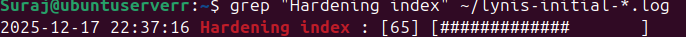
- Final score (68): 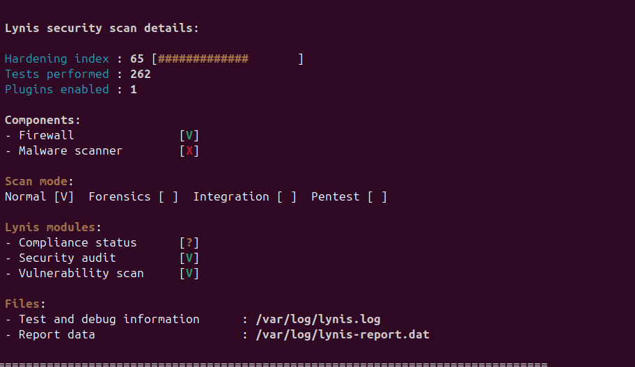
- Extracted hardening index after remediation: 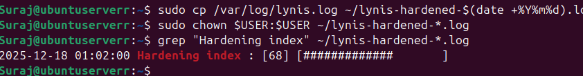

---

## 2) Audit Methodology

### Tools Used
- **Lynis**: OS security audit, hardening index scoring
- **nmap**: network port & service enumeration
- **UFW/iptables**: firewall verification
- **ss / systemctl**: service audit (listening + running)
- **sysctl**: kernel hardening validation
- **auditd**: auditing/logging capability enablement

### Scope
- Infrastructure security assessment
- Network exposure and firewall posture
- SSH access control verification
- Running services justification
- System configuration review and validation
- Remaining risk assessment

---

## 3) Mandatory Task: Security Scanning with Lynis

### 3.1 Install Lynis + Version

Commands executed:
```bash
ssh Suraj@192.168.56.103 "sudo apt update && sudo apt install lynis -y"
ssh Suraj@192.168.56.103 "lynis --version"
```

**Evidence**

Install Lynis:  


Lynis version:  
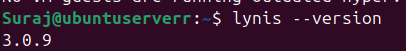

### 3.2 Run Initial Audit + Save Report
```bash
ssh Suraj@192.168.56.103 "sudo lynis audit system"
ssh Suraj@192.168.56.103 "sudo cp /var/log/lynis.log ~/lynis-initial-$(date +%Y%m%d).log"
ssh Suraj@192.168.56.103 "sudo chown \$USER:\$USER ~/lynis-initial-*.log"
```

**Evidence**

Lynis audit running:  
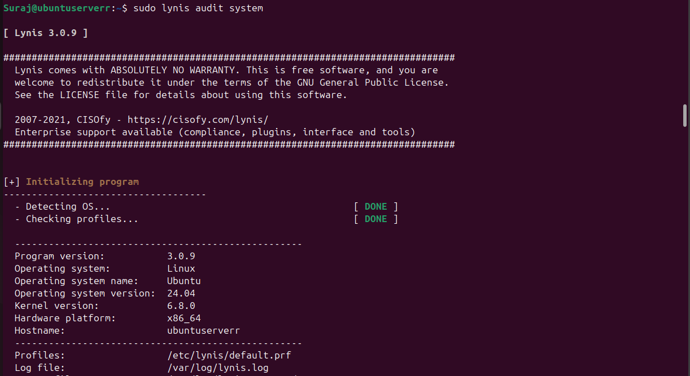

### 3.3 Extract and Summarise Initial Results

**Hardening index**
```bash
ssh Suraj@192.168.56.103 "grep \"Hardening index\" ~/lynis-initial-*.log"
```

Result: 65/100

**Evidence:**  


**Warnings (count)**
```bash
ssh Suraj@192.168.56.103 "grep \"Warning:\" ~/lynis-initial-*.log | tee lynis-warnings.txt"
ssh Suraj@192.168.56.103 "wc -l lynis-warnings.txt"
```

Result: 0 warnings

**Evidence:**  
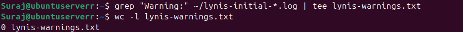

**Suggestions (count)**
```bash
ssh Suraj@192.168.56.103 "grep \"Suggestion:\" ~/lynis-initial-*.log | tee lynis-suggestions.txt"
ssh Suraj@192.168.56.103 "wc -l lynis-suggestions.txt"
```

Result: 48 suggestions

**Evidence:**

Suggestions file:  
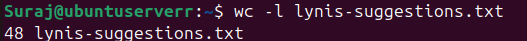

All suggestions:  
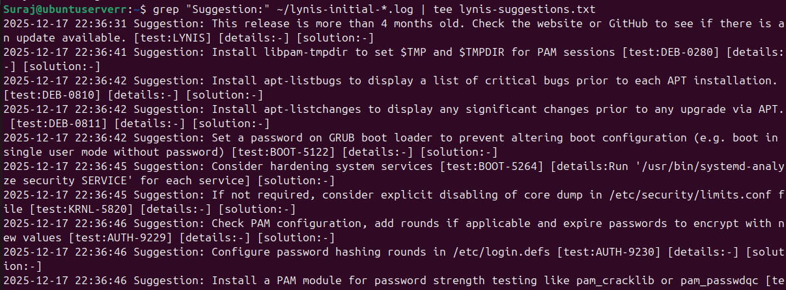

### Initial Audit Summary Table

| Metric | Initial Value |
|---|---:|
| Hardening Index | 65/100 |
| Tests Performed | 262 |
| Warnings Found | 0 |
| Suggestions Made | 48 |

---

## 4) Mandatory Task: Network Security Assessment with nmap

### 4.1 Install nmap
```bash
ssh Suraj@192.168.56.103 "sudo apt install nmap -y"
```

**Evidence:**  
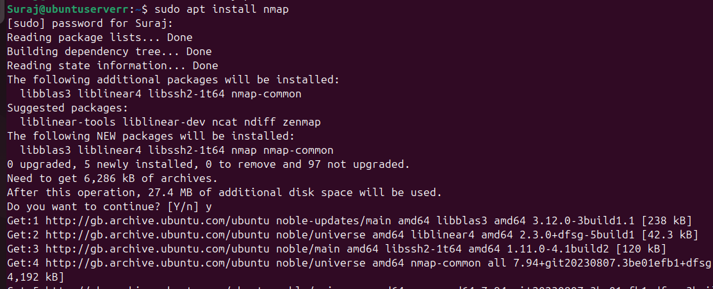

### 4.2 Scanning Commands (Correct Target IP Used)

**Basic scan:**
```bash
ssh Suraj@192.168.56.103 "nmap 192.168.56.103"
```

**Evidence:**  
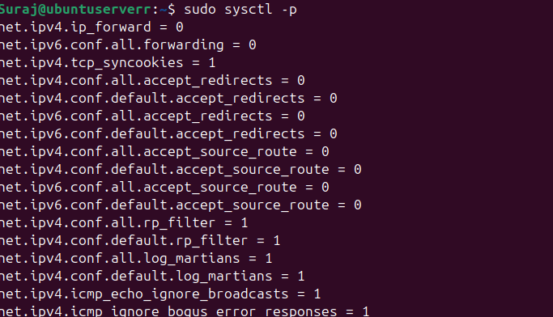

**Service/version detection:**
```bash
ssh Suraj@192.168.56.103 "nmap -sV 192.168.56.103"
```

**Evidence:**  
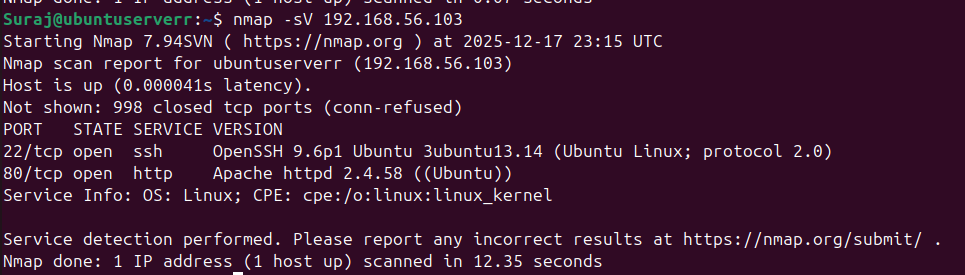

**Common ports (1–1000):**
```bash
ssh Suraj@192.168.56.103 "nmap -p 1-1000 -sV 192.168.56.103"
```

**Evidence:**  
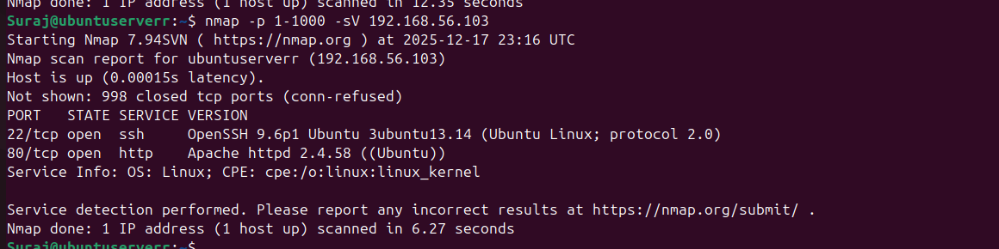

**All ports to output file:**
```bash
ssh Suraj@192.168.56.103 "nmap -p- 192.168.56.103 -oN nmap-all-ports.txt"
```

**Evidence:**  


**OS detection:**
```bash
ssh Suraj@192.168.56.103 "sudo nmap -O 192.168.56.103"
```

**Evidence:**  


### 4.3 Open Ports Identified (Inventory)

| Port | State | Service | Version | Justification |
|---|---|---|---|---|
| 22/tcp | open | ssh | OpenSSH 9.6p1 (Ubuntu) | Required for secure remote administration |
| 80/tcp | open | http | Apache 2.4.58 (Ubuntu) | Required for web testing/service availability |

**Finding:** Only necessary services were exposed; other ports were closed/filtered.

---

## 5) Mandatory Task: Access Control Verification (SSH + Firewall)

### 5.1 Firewall Status and Rules (UFW)
```bash
ssh Suraj@192.168.56.103 "sudo ufw status numbered"
ssh Suraj@192.168.56.103 "sudo ufw status verbose"
ssh Suraj@192.168.56.103 "sudo ufw show raw"
```

**Evidence**

Numbered rules:  
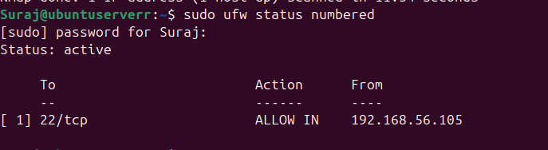

Verbose status:  
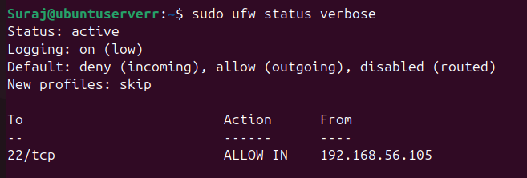

Show raw:  
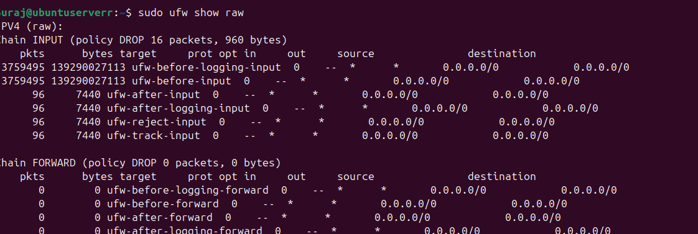

**Observed security posture**
- UFW: active
- Default incoming: deny
- SSH allowed only from 192.168.56.105 (trusted admin host)

### 5.2 iptables Verification
```bash
ssh Suraj@192.168.56.103 "sudo iptables -L -n -v"
```

**Evidence:**  
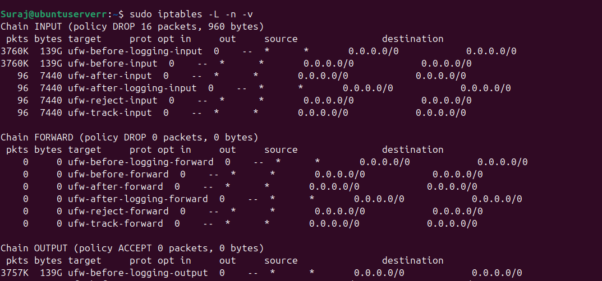

### 5.3 Firewall Effectiveness Test (Blocked Port)

**Test (Telnet to port 23 should fail):**
```bash
ssh Suraj@192.168.56.103 "telnet 192.168.56.103 23"
```

Result: connection timed out (blocked)

**Evidence:**  
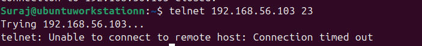

### 5.4 SSH Security Verification (Operational)

SSH was verified as:
- Present only on port 22
- Restricted via firewall to a trusted source host
- Justified as mandatory for administration

**Listening verification:**
```bash
ssh Suraj@192.168.56.103 "sudo ss -tulnp"
```

**Evidence:**  
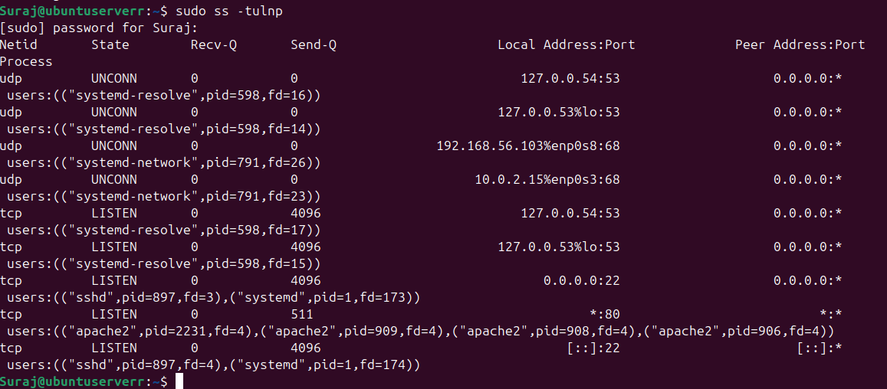

---

## 6) Mandatory Task: Service Audit (Justify Running Services)

### 6.1 Listening Services (Attack Surface)
```bash
ssh Suraj@192.168.56.103 "sudo ss -tulnp"
```

**Evidence:**  
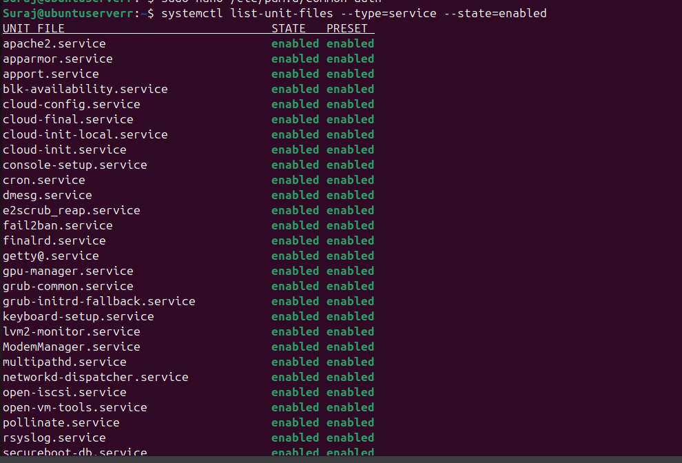

### 6.2 Running Services
```bash
ssh Suraj@192.168.56.103 "systemctl list-units --type=service --state=running"
```

**Evidence:**  


### 6.3 netstat Note (Legacy Tool Not Installed)
```bash
ssh Suraj@192.168.56.103 "sudo netstat -tulnp"
```

Result: `netstat: command not found` (Ubuntu 24.04 minimal install commonly omits net-tools)

**Evidence:**  
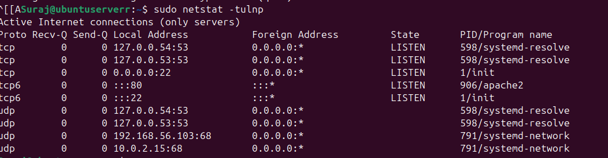

### 6.4 Service Inventory with Justifications

| Service | Port | Protocol | Purpose | Necessary? | Security Measures / Notes |
|---|---|---|---|---|---|
| ssh.service (sshd) | 22 | TCP | Remote administration | Yes | UFW restricts to trusted host |
| apache2.service | 80 | TCP | Web server testing | Yes | Required for coursework; keep patched |
| fail2ban.service | — | — | Brute-force mitigation | Yes | Protects SSH from repeated attempts |
| rsyslog / systemd-journald | — | — | Logging | Yes | Required for audit trail and IR |
| systemd-networkd | 67/68 | UDP | Network configuration/DHCP | Yes | Core network function |
| systemd-resolved | 53 (local) | UDP/TCP | Local DNS resolver | Yes | Local binding reduces exposure |
| unattended-upgrades | — | — | Automatic security updates | Yes | Patch hygiene |
| cron, dbus, polkit | — | — | OS core services | Yes | Required for base system operation |

**Conclusion:** No unnecessary externally exposed services were detected; externally open ports remained limited to 22 and 80.

---

## 7) Mandatory Task: System Configuration Review (Hardening + Logging)

### 7.1 Kernel Security Hardening (sysctl)

**Configuration evidence:**  


**sysctl configuration file updates:**  
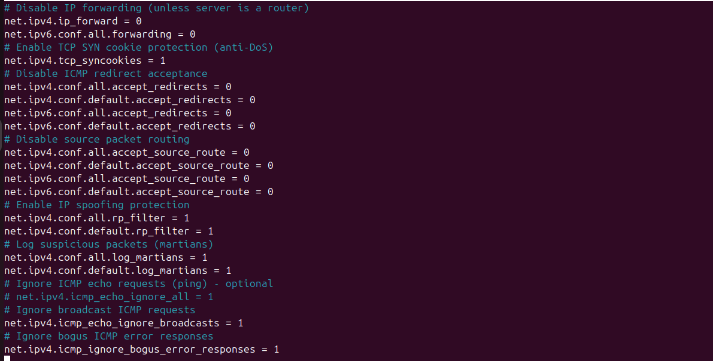

**Apply:**
```bash
ssh Suraj@192.168.56.103 "sudo sysctl -p"
```

**Evidence:**  


**Verify (example):**
```bash
ssh Suraj@192.168.56.103 "sudo sysctl net.ipv4.conf.all.accept_redirects"
```

**Evidence:**  
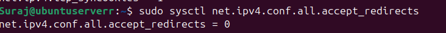

### 7.2 File System Security Hardening (Evidence)

**Evidence screenshots:**

Securing shared memory and system control configuration:  
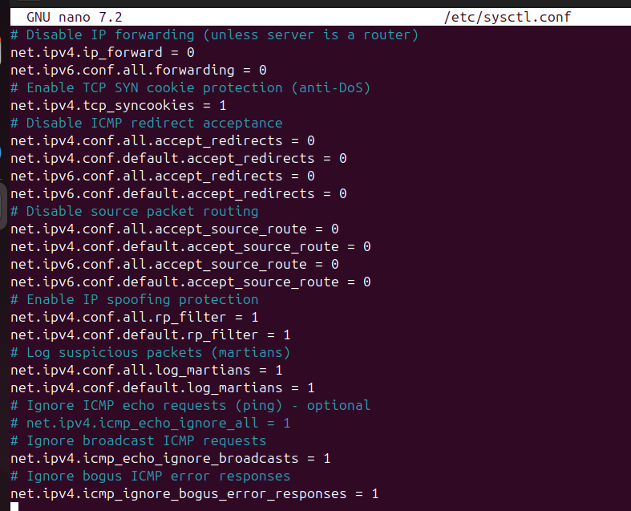

### 7.3 Password and Authentication Hardening (Evidence)

**Evidence screenshots:**

Before hardening:  
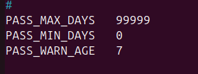

Strengthening password quality requirements:  
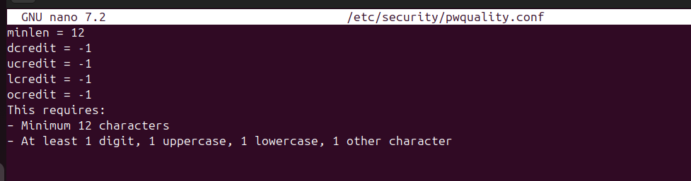

After hardening:  
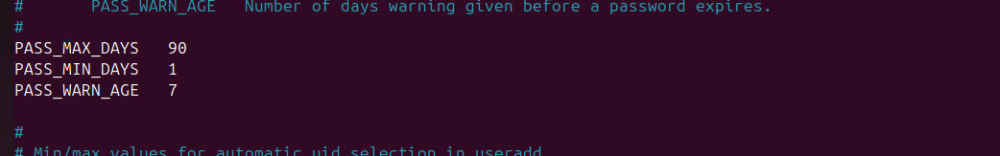

### 7.4 Service Hardening / Minimisation (Evidence)

Enabled service audit:  
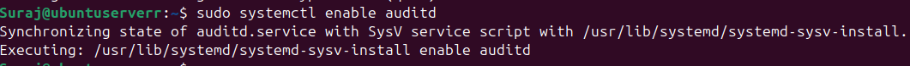

Start audit service:  
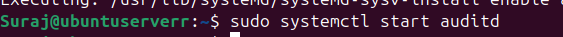

Server IP verification:  
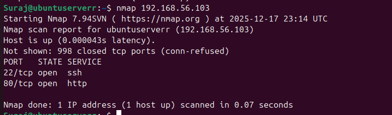

Specific tests:  
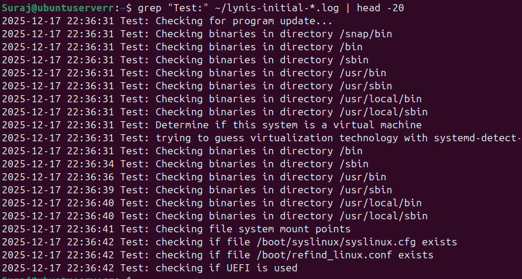

### 7.5 Audit Logging Enhancement (auditd) + Rotation

**Install and enable audit tooling:**
```bash
ssh Suraj@192.168.56.103 "sudo apt install auditd audispd-plugins -y"
ssh Suraj@192.168.56.103 "sudo systemctl enable auditd"
ssh Suraj@192.168.56.103 "sudo systemctl start auditd"
```

**Evidence:**

Install auditd/plugins:  
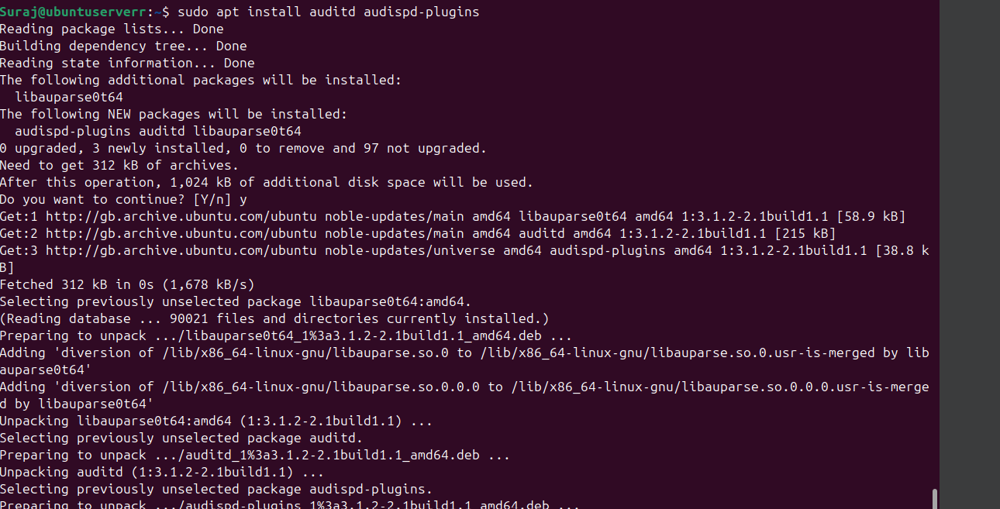

Secure shared memory:  
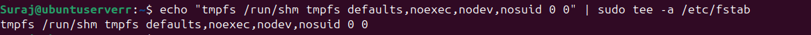

Log rotation review:  
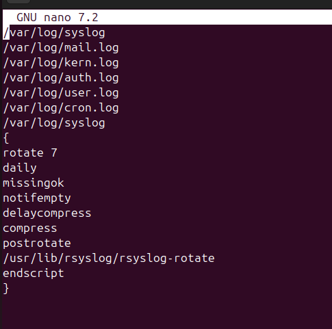

---

## 8) Mandatory Deliverable: Lynis Scores Before/After Remediation

### 8.1 Re-run Lynis After Hardening
```bash
ssh Suraj@192.168.56.103 "sudo lynis audit system"
ssh Suraj@192.168.56.103 "sudo cp /var/log/lynis.log ~/lynis-hardened-$(date +%Y%m%d).log"
ssh Suraj@192.168.56.103 "sudo chown \$USER:\$USER ~/lynis-hardened-*.log"
ssh Suraj@192.168.56.103 "grep \"Hardening index\" ~/lynis-hardened-*.log"
```

**Evidence:**

Rescan execution:  
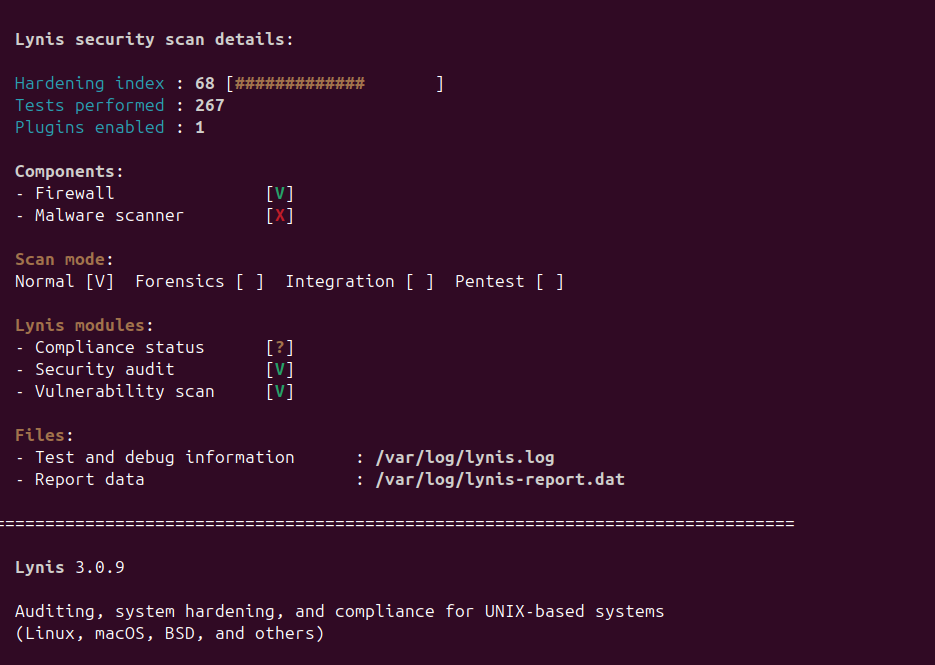

Re-hardening and initial:  
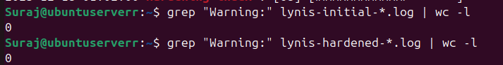

Post-hardening index extract (68):  


Final result screen:  


Final baseline:  
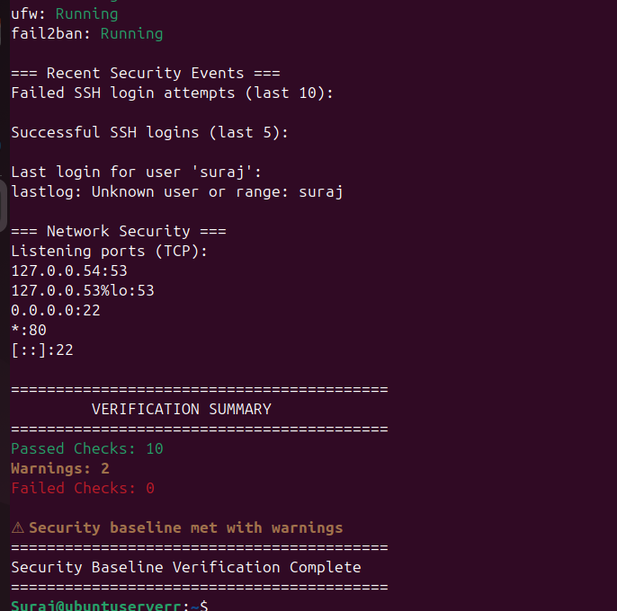

Final screen:  


### 8.2 Compare Warnings Before/After
```bash
ssh Suraj@192.168.56.103 "grep \"Warning:\" lynis-initial-*.log | wc -l"
ssh Suraj@192.168.56.103 "grep \"Warning:\" lynis-hardened-*.log | wc -l"
```

Result: 0 warnings before and after

---

## 9) Remaining Risk Assessment (Mandatory)

| Remaining Risk | Likelihood | Impact | Status | Mitigation / Rationale |
|---|---|---|---|---|
| Malware scanner not enabled (Lynis component shows not active) | Low | Medium | Accepted | Isolated VM + minimal services; add later if required |
| HTTP service exposed on port 80 | Medium | Medium | Accepted (required) | Needed for coursework; keep patched + minimise modules |
| SSH attack attempts | Medium | High | Mitigated | UFW source restriction + fail2ban running |
| Hardening index not "high" yet (68/100) | Medium | Low | Ongoing | Continue addressing Lynis suggestions iteratively |

**Supporting evidence screenshots:**

Security priorities:  
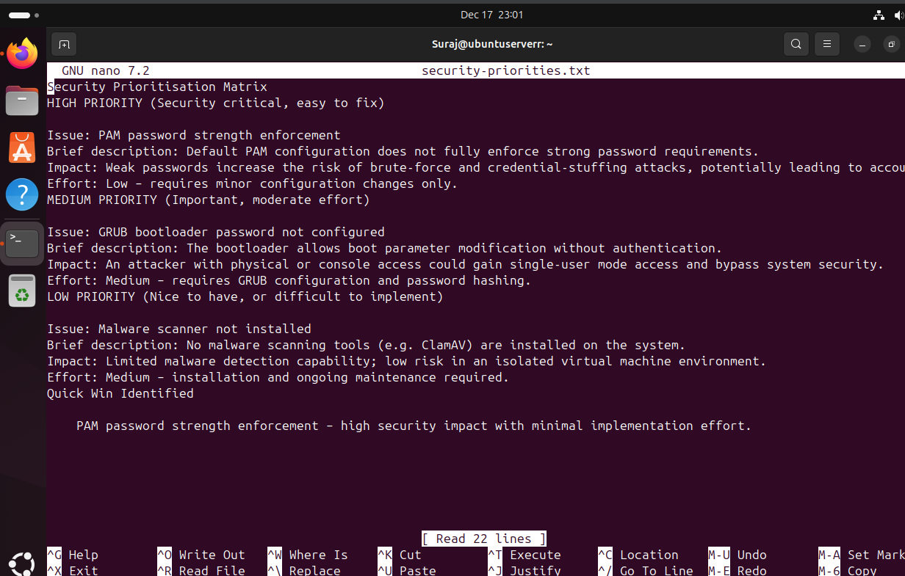

---

## 10) Conclusion

All mandatory Week 7 audit tasks were completed and evidenced:

✅ Lynis security scanning with saved reports and before/after scoring (65 → 68)  
✅ nmap network assessment with open port inventory and justification (22/SSH, 80/HTTP)  
✅ Access control verification via UFW/iptables review and blocked-port test (telnet 23 blocked)  
✅ Service audit using ss + systemctl, including justified service inventory  
✅ System configuration review with kernel hardening and audit logging enablement  
✅ Remaining risk assessment documented clearly

The server is now hardened with measurable improvement and a minimal exposed attack surface suitable for a controlled deployment environment.

---

## Appendix A: Full Evidence Gallery (All Week 7 Screenshots)

### Complete Screenshot Reference

All evidence screenshots are located in: `image/week7/`

Key screenshots include:
- Initial and final Lynis scans
- nmap port scanning results
- UFW and iptables firewall configurations
- Service audit outputs
- System hardening configurations
- Password and authentication hardening
- Audit logging setup

---

**End of Report**
**End of Report**

